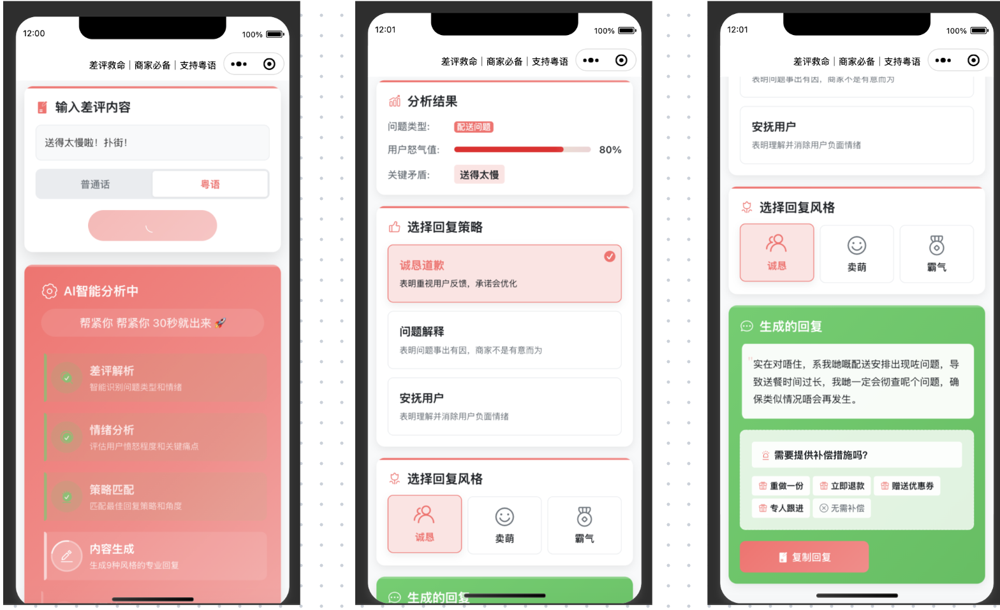

# 差评转化助手 (Negative Review Helper)

[](https://opensource.org/licenses/MIT)

> 一款 AI 赋能的差评处理工具，旨在帮助商家将负面评价转化为提升顾客满意度的机会。

---

| 网页版 (Web) - 实时演示 | 小程序版 (Mini Program) |
| :---: | :---: |
| [**➡️ 点击访问 (Coming Soon)**]() |  |

---

## 💡 项目缘起 & 产品思考 (The "Why")

### 1. 我观察到的问题 (The Problem)

对于许多中小型商家（尤其是餐饮、电商）而言，负面评价是经营中不可避免的痛点。一条处理不当的差评，不仅会影响潜在消费者的决策，还可能激化矛盾，损害品牌声誉。然而，很多商家缺乏专业培训，在回应时常常陷入两种困境：
- **模板化回复**："亲，非常抱歉给您带来不便..."，空洞无物，无法解决用户根本问题。
- **情绪化争辩**：与顾客争执，导致事态升级，造成更坏的公关影响。

### 2. 我的解决方案 (The Solution)

为了解决这个痛点，我设计并开发了"差评转化助手"。它不是一个简单的"回复生成器"，而是一个**决策辅助工具**。它利用大语言模型（LLM）的分析和生成能力，帮助商家理解差评背后的真正问题，并提供专业、得体、且符合品牌形象的回复策略。

### 3. 核心产品原则 (Core Product Principles)

在设计过程中，我遵循了以下几个核心原则，这集中体现在网页版和小程序版的设计差异上：

#### A. 情景化用户体验 (Context-Aware UX)
我认识到，用户在不同设备上处理差评时的心态和场景是不同的。因此，我为双端设计了截然不同的交互流程：
- **网页版 (Web)**: 采用"**分步引导式**"流程。它更适合在 PC 端坐下来进行**深度、细致**的工作。用户被引导着一步步进行"分析 -> 选择角度 -> 生成 -> 风格润色"，产出的回复更加定制化和可控。
- **小程序版 (Mini Program)**: 采用"**两阶段模型**"。它更适合在移动端进行**快速、即时**的处理。第一阶段，它快速生成多个**绝对安全、无成本承诺**的回复，让店长在忙乱中可以先用一个得体的回复稳住顾客情绪。如果需要，再进入第二阶段提供具体补偿。

#### B. 安全边界与成本控制 (Safety & Cost-Control by Design)
对于商家而言，**控制意外成本**至关重要。小程序版的"两阶段模型"是一个深思熟虑的设计：它在产品层面就建立了一道"防火墙"，将"安抚情绪"和"提供补偿"两个行为明确分开。这可以有效避免用户（比如新上手的店员）在不了解情况下，随意做出"免单"、"赠送"等计划外承诺，为商家规避了潜在的经济损失。

#### C. AI 赋能而非取代 (Empowerment over Automation)
当前很多 AI 工具追求"一键完成"，但这在需要精细化沟通的客服场景中并非最优解。本工具的设计理念是**赋能 (Empowerment)**。它通过提供多种"回复角度"和"沟通风格"的选择，将最终的判断权和决策权交还给用户，让 AI 成为一个强大的助手，而不是一个黑盒的决策者。

---

## 🤖 AI 产品经理的核心思考 (AI PM Core Competencies)

作为一款 AI Native 应用，本项目不仅仅是调用 API，更体现了在产品设计中应对 AI 独特挑战的思考。

### 1. Prompt Engineering 即产品设计

在 AI 应用中，**Prompt 是产品规格书 (Product Spec) 的一部分**。我如何向 LLM 下达指令，直接决定了用户得到的结果质量。

例如，在小程序的第一阶段，为了实现"绝对安全"的回复，我的核心 Prompt 强调了严格的负向约束：
```
**核心任务**:
1.  **深度分析差评**: ...
2.  **生成高质量、无成本承诺的回复**: ...
3.  **严格的安全限制**: **绝对禁止** 在回复中提及任何形式的具体补偿措施，例如"退款"、"重做"、"补送"、"优惠券"、"代金券"、"折扣"等词语。回复应聚焦于安抚情绪、解释问题和表达歉意。
4.  **格式化输出**: ... 必须是完整的、可以被程序直接解析的`JSON`对象...
```
这个 Prompt 的设计体现了对业务目标的深刻理解：在安抚阶段，首要任务是**风险规避**，而非解决问题。

### 2. 管理模型的不确定性 (Managing Uncertainty)

LLM 的一大特点是其输出的**不确定性**。一个优秀的产品设计必须能驾驭这种不确定性。
- **小程序版的"两阶段模型"** 就是一个典型的例子。我没有让 AI 一次性生成一个"完美"但可能包含风险的回复，而是让它先生成多个**范围可控、确定安全**的选项。这大大降低了"AI 幻觉"或"过度承诺"给商家带来损失的风险。
- **网页版的"分步引导"** 则是另一种管理方式。通过将复杂任务分解成多个简单步骤，每一步都由用户确认，从而确保最终结果在用户的掌控之中，避免了 AI "自由发挥"带来的不可控。

### 3. 平衡"成本-延迟-质量"三角

AI 应用的运营绕不开对 **成本(Cost)、延迟(Latency)和质量(Quality)** 的权衡。
- **一次性生成 vs. 分步生成**：在设计阶段，我评估了两种方案。小程序采用了**近似一次性生成**的模式（一次调用生成9个回复），这样做虽然**初始延迟稍高、成本稍多**，但换来了后续用户切换时**丝滑的零延迟体验**，这在移动端至关重要。而网页版则采用**分步生成**，这种模式**单次请求快、成本低**，符合 PC 端用户更具耐心的操作习惯。
- 这种基于不同平台用户场景的差异化决策，是 AI 产品经理在资源限制下寻求最优解的关键体现。

---

## ⚙️ 核心设计：小程序版"两阶段模型"

以最具代表性的小程序版为例，其独特的"两阶段模型"设计思路可以通过以下流程图与时序图清晰展现。

### 用户流程图


### 数据时序图

*注：为简洁起见，此图仅展示第一阶段核心流程。*

---

## ✨ 主要功能 (Key Features)

- **AI 驱动分析**: 自动分析差评中的顾客情绪、问题类型和核心关键词。
- **双平台差异化实现**: 为 Web 和小程序提供两种不同的、符合使用场景的交互模型。
- **风格与角度定制**: 支持多种回复角度和沟通风格，适应不同品牌人设。
- **技术栈清晰**: 前后端分离，双端架构展示了在不同技术选型下的思考与权衡。

---

## 🛠️ 技术实现 (Technical Implementation)

| 分类 | 网页版 (Web) | 微信小程序 (Mini Program) |
| :--- | :--- | :--- |
| **前端** | `React Native for Web` (Expo) | 原生小程序 (WXML, WXSS) |
| **后端** | `Node.js` + `Express` / `Fastify` | 微信云函数 (Serverless) |
| **核心** | 大语言模型 (LLM) API | 大语言模型 (LLM) API |
| **设计理念**| 引导式、深度定制 | 快速响应、安全边界 |

```
/
├── negative-review-helper-web/ # 网页版前端代码
├── cloudfunctions/             # 小程序云函数
├── miniprogram/                # 小程序前端代码
├── assets/                     # 静态资源 (如截图)
│   └── miniprogram-showcase.jpg
├── design doc/                 # 设计文档
└── ...
```

---

## 🚀 本地运行 (Getting Started)

在开始之前，请确保你的环境中已经安装了 [Node.js](https://nodejs.org/) 和 [微信开发者工具](https://developers.weixin.qq.com/miniprogram/dev/devtools/download.html)。

### 网页版 (Web)

1.  **克隆项目到本地**:
    ```bash
    git clone https://github.com/your-username/your-repo-name.git
    cd your-repo-name
    ```

2.  **进入网页版目录并安装依赖**:
    ```bash
    cd negative-review-helper-web
    npm install
    ```

3.  **配置环境变量**:
    - 在 `negative-review-helper-web` 目录下，复制 `.env.example` (如果不存在，请创建一个) 为 `.env` 文件。
    - 在 `.env` 文件中填入你的大语言模型 API 密钥等信息。
      ```
      LLM_API_KEY="sk-..."
      API_BASE_URL="https://api.example.com"
      ```

4.  **启动开发服务器**:
    ```bash
    npm start
    ```

### 微信小程序 (Mini Program)

1.  **启动开发者工具**并导入本项目根目录。

2.  **配置云函数**:
    - 在云函数的代码中，你需要填入你的大语言模型 API 密钥。**强烈建议**使用云开发的环境变量功能来存储密钥，而不是硬编码在代码中。
    - 分别进入各云函数目录 (`cloudfunctions/*`) 安装依赖 `npm install`。

3.  **部署云函数**:
    - 在开发者工具中，右键点击需要部署的云函数，选择"上传并部署：云端安装依赖"。

---

## 🤝 贡献 (Contributing)

欢迎各种形式的贡献！详情请查阅 [CONTRIBUTING.md](./CONTRIBUTING.md)。

---

## 📄 许可证 (License)

该项目采用 [MIT License](./LICENSE) 授权。

---
