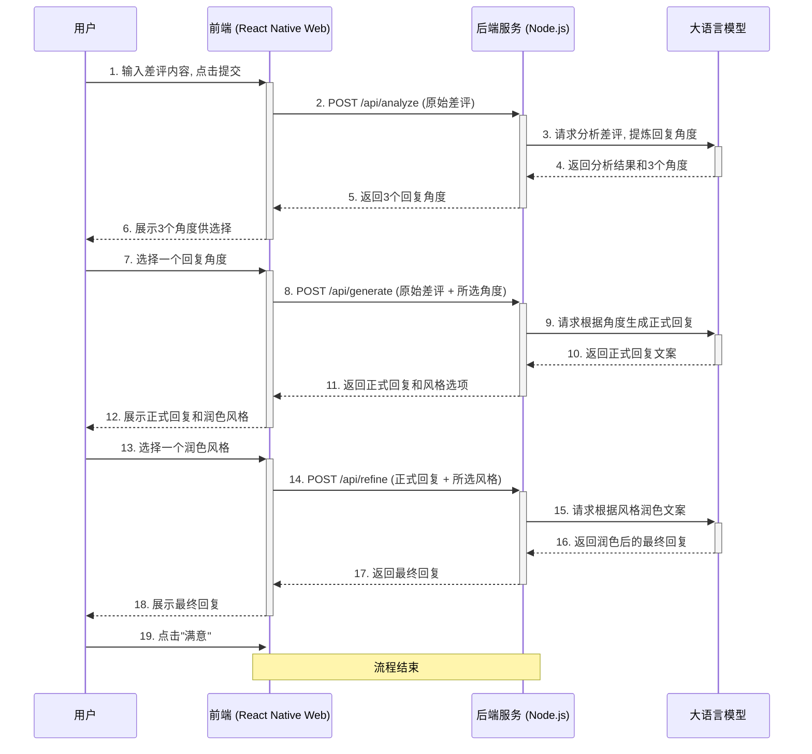
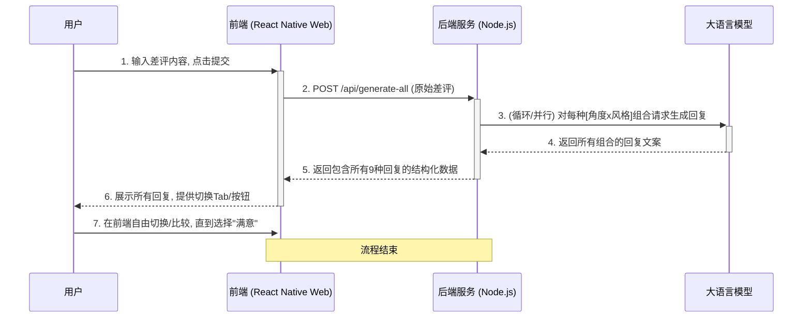

# 差评转化助手 - 技术设计文档

本文档旨在规划"差评转化助手"网页应用的技术实现方案，包含用户流程、数据交互和系统架构设计。

## 1. 用户流程图

流程图清晰地描述了用户从输入差评到获得满意回复的完整路径。

```mermaid
graph TD
    A[用户访问网页] --> B{输入差评内容};
    B --> C[点击 "开始分析"];
    C --> D[系统分析差评并提供3个回复角度];
    D --> E{用户选择一个角度};
    E --> F[系统根据角度生成正式回复];
    F --> G{用户选择润色风格};
    G --> H[系统根据风格润色回复];
    H --> I{用户确认最终回复};
    I -- "满意" --> J[流程结束];
    I -- "补充" --> K[返回修改(可扩展)];
```

## 2. 数据时序图 (分步引导方案)

时序图展示了用户、前端、后端和AI模型之间的数据流动和交互顺序，明确了各个模块的职责。



## 3. 项目预期架构

我们将采用前后端分离的架构，以实现最佳的开发效率和系统扩展性。

### 3.1 前端 (Frontend)

*   **技术栈**: **React Native for Web (基于 Expo)**。
    *   **理由**: 沿用 `project 13` 的技术栈。这套方案的核心优势在于"一次编写，多端运行"，能完美生成适配移动端浏览器的响应式网页，同时保留了未来打包成原生App的可能性。
*   **核心职责**:
    1.  提供用户交互界面。
    2.  管理应用在不同步骤间的状态（如当前是第几步，用户的输入和选择是什么）。
    3.  调用后端API，并向用户展示返回结果。
*   **关键组件（建议）**:
    *   `ReviewInputScreen`: 用户输入差评的初始页面。
    *   `AngleSelection`: 用于展示和选择回复角度的组件。
    *   `StyleSelection`: 用于展示和选择润色风格的组件。
    *   `ResultDisplay`: 用于展示各阶段生成文案的组件。

### 3.2 后端 (Backend) - *需要新建*

*   **技术栈**: **Node.js + Express/Fastify**。
    *   **理由**: 轻量、高效，非常适合构建作为中间层（BFF - Backend for Frontend）的API服务。
*   **核心职责**:
    1.  接收前端的请求。
    2.  安全地管理和使用LLM的API密钥（**严禁将API密钥暴露在前端**）。
    3.  根据业务逻辑（`工作流设计.md`）构建和格式化发送给LLM的指令（Prompt）。
    4.  解析LLM的返回结果，并将其以标准化的格式（如JSON）返回给前端。
*   **API 端点 (Endpoints)**:
    *   `POST /api/analyze`: 接收原始差评，返回回复角度。
    *   `POST /api/generate`: 接收原始差评和选定角度，返回正式回复。
    *   `POST /api/refine`: 接收正式回复和选定风格，返回最终润色后的回复。

### 3.3 大语言模型 (LLM)

*   **角色**: 作为应用的大脑，执行所有自然语言处理任务。
*   **集成方式**: 后端服务将通过API调用一个外部的LLM服务（如 OpenAI的GPT系列、Google的Gemini、或者其他任何兼容的语言模型）。
*   **关键任务**:
    1.  **分析**: 理解差评的情感、意图和关键点。
    2.  **生成**: 根据指令创作符合要求的文本内容。
    3.  **润色**: 根据指定的风格迁移文本。

## 4. 备选交互方案探讨 (一次性生成)

在讨论中，我们构思了另一种交互模型：在用户提交差评后，后端一次性生成所有可能的回复组合（例如3个角度 x 3种风格 = 9个结果），前端直接将这些结果展示给用户，让用户自由切换和选择。

这种方案的优缺点如下：
*   **优点**:
    *   **交互流畅**: 用户提交后，所有结果一次性加载，后续切换无需等待，体验非常流畅。
    *   **决策高效**: 用户可以快速地在不同结果之间进行比较，决策效率高。
*   **缺点**:
    *   **首次等待长**: 后端需要进行多次LLM调用，导致用户提交后的首次等待时间显著增加。
    *   **成本更高**: 会生成一些用户可能永远不会选择的回复，增加了LLM的token消耗和计算成本。
    *   **信息过载**: 一次性展示过多选项可能会让新用户感到困惑和不知所措。

**结论**: 考虑到初版的用户体验和成本控制，我们优先实现分步引导方案。一次性生成方案可作为未来的一个重要迭代方向。

### 4.1 数据时序图 (一次性生成方案)


