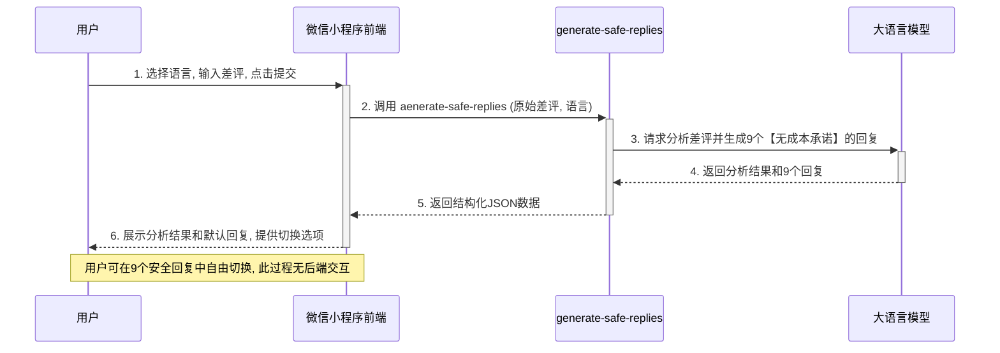
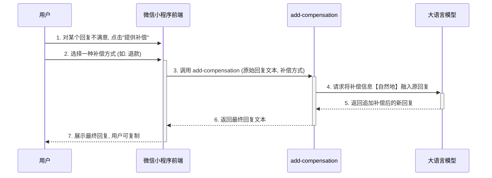

# 差评转化助手 - 微信小程序技术设计文档 (v2.0)

本文档旨在为"差评转化助手"的微信小程序版本提供技术实现方案。该方案采用创新的**两阶段回复生成模型**，旨在确保商业安全与成本效益。

## 1. 用户流程图 (两阶段模型)

```mermaid
graph TD
    subgraph "第一阶段: 快速生成安全回复"
        A[用户打开小程序] --> B{选择语言并输入差评};
        B --> C[点击分析];
        C --> D[后台生成9个无成本承诺的回复];
        D --> E{前端展示分析结果和默认回复};
        E -- 用户切换角度/风格 --> F[前端即时切换预加载的9个回复];
    end

    subgraph "第二阶段: (可选)追加补偿措施"
        F --> G{用户不满意/需补偿?};
        G -- "是" --> H[点击"提供补偿"按钮];
        H --> I{选择具体补偿方式};
        I --> J[后台将补偿信息融入原回复];
        J --> K[前端展示追加补偿后的最终回复];
    end

    F -- "否, 直接满意" --> L[点击复制, 流程结束];
    K --> L;

```

## 2. 数据时序图 (两阶段模型)

### 2.1 第一次调用: `generate-safe-replies`



### 2.2 第二次调用 (可选): `add-compensation`



## 3. API 调用与 Prompt 设计 (两阶段模型)

### 3.1 第一次调用: `generate-safe-replies`

*   **云函数名**: `generate-safe-replies`
*   **功能**: 接收原始差评和指定语言，返回问题分析和9个不包含任何具体成本承诺（如退款、重做、优惠券）的回复。
*   **核心指令 (Prompt) v3.0**:

---
**角色**: 你是一个顶级的餐厅客服专家，拥有多年的客户关系处理经验，尤其擅长处理外卖差评。你的目标是通过专业、有同理心且高效的沟通，将负面评价转化为正面体验。

**核心任务**:
1.  **深度分析差评**: 对以下用户差评进行多维度分析。
2.  **生成高质量、无成本承诺的回复**: 根据分析结果，结合多种【角度】和【风格】，为指定的 **{{language}}** 生成9种回复。
3.  **严格的安全限制**: **绝对禁止** 在回复中提及任何形式的具体补偿措施，例如"退款"、"重做"、"补送"、"优惠券"、"代金券"、"折扣"等词语。回复应聚焦于安抚情绪、解释问题和表达歉意。
4.  **格式化输出**: 你的最终回答必须是完整的、可以被程序直接解析的`JSON`对象，严格遵循以下结构，不要有任何多余的文字、解释或代码块标记。

**回复质量准则 (必须严格遵守)**:
*   **避免空话套话**: 不要使用"我们深感抱歉"、"给您带来不便敬请谅解"等模板式语句。
*   **共情与安抚**: 真诚地站在用户的角度理解他的感受。
*   **主动承担责任**: 不要推卸责任，直接承认问题所在。
*   **承诺跟进，而非成本补偿**: 可以承诺进行内部调查、或由专人联系客户，但不能直接提出任何需要成本的补偿方案。
*   **体现品牌个性**: 在不同风格的回复中，注入对应的品牌人设。

**用户差评**:
```
{{reviewText}}
```

**输出JSON结构**:
```json
{
  "analysis": {
    "issueType": "分析出的问题类型 (例如: 配送问题, 菜品质量, 服务态度)",
    "anger": "一个代表用户愤怒程度的整数 (0-100)",
    "keywords": "提取出的核心矛盾关键词 (字符串)"
  },
  "replies": {
    "诚恳道歉+承诺跟进": {
      "sincere": "基于'诚恳道歉+承诺跟进'角度的诚恳回复",
      "cute": "基于'诚恳道歉+承诺跟进'角度的卖萌回复",
      "confident": "基于'诚恳道歉+承诺跟进'角度的霸气回复"
    },
    "问题解释+补救": {
      "sincere": "...",
      "cute": "...",
      "confident": "..."
    },
    "幽默化解+诱惑": {
      "sincere": "...",
      "cute": "...",
      "confident": "..."
    }
  }
}
```
---

### 3.2 第二次调用: `add-compensation`
*   **云函数名**: `add-compensation`
*   **功能**: 接收一个已经生成好的回复文本和一种补偿方式，将补偿信息自然地融入到原文本中，返回最终版本。
*   **核心指令 (Prompt) v3.1**:

---
**角色**: 你是一个专业的文本编辑。

**核心任务**:
1.  **理解原文**: 阅读下面提供的【原始回复文本】。
2.  **融入补偿**: 将指定的【补偿措施】自然、流畅地整合进原始回复中，使其看起来像一个完整的、一气呵成的回复。不要只是简单地在末尾追加。
3.  **保持风格**: 在修改过程中，必须保持【原始回复文本】的语气和风格不变。
4.  **直接输出**: 你的回答只能包含修改后的最终回复文本，不要有任何额外的解释或标签。

**原始回复文本**:
```
{{originalReply}}
```

**补偿措施**:
```
{{compensationType}} (例如: 我们将立刻为您办理全额退款 / 我们已经安排为您重新制作一份, 骑手马上就到)
```
---

## 4. 项目预期架构

小程序的架构将采用微信官方推荐的"小程序 + 云开发"模式。

### 4.1 前端 (Frontend) - 微信小程序

*   **技术栈**: **微信小程序原生开发 (WXML + WXSS + JavaScript)**。
    *   **理由**: 提供最贴合微信生态的原生体验，性能优越，可以方便地调用微信的各种API（如登录、支付、分享等）。
*   **核心职责**:
    1.  使用小程序组件库构建用户界面。
    2.  管理和存储从后端一次性获取的多个回复结果。
    3.  根据用户的选择（例如通过`<picker>`或自定义组件），在本地即时更新展示的回复内容。
    4.  调用后端API。
*   **关键页面/组件**:
    *   `pages/index/index`: 核心页面，承载输入、选择和结果展示的完整流程。
    *   `components/Selector/Selector`: 用于选择角度和风格的自定义组件。

### 4.2 后端 (Backend) - 云函数 (腾讯云云开发)

*   **技术栈**: **腾讯云云开发 (CloudBase)**。
    *   **理由**: 这是微信官方推荐的无服务器(Serverless)方案。它免去了购买和维护服务器的成本，提供了慷慨的免费额度，并且可以安全地在云端管理和调用大模型的API密钥，与小程序前端无缝集成。
*   **核心职责**:
    1.  作为小程序的安全后端，响应前端请求。
    2.  在云函数中安全地存储和使用LLM的API密钥。
    3.  执行调用大模型的业务逻辑。
*   **核心云函数**:
    *   `generate-safe-replies`: （第一阶段核心函数）接收原始差评，返回分析和9个安全回复。
    *   `add-compensation`: （第二阶段可选函数）接收指定回复和补偿类型，返回追加补偿后的最终回复。

### 4.3 微信生态集成 (可选)

*   **微信登录**: 免去用户注册步骤，提升转化率。
*   **分享功能**: 用户可以将满意的回复分享给同事或朋友。
*   **模板消息**: 在处理完成后，发送服务通知（需用户授权）。 

## 5. 项目目录结构

为了保持项目清晰、可维护，我们采用小程序云开发的标准目录结构：

```
/
├── cloudfunctions/         # 云函数目录
│   ├── generate-safe-replies/ # "生成安全回复"的云函数
│   │   ├── index.js
│   │   └── package.json
│   └── add-compensation/   # "追加补偿措施"的云函数
│       ├── index.js
│       └── package.json
│
├── miniprogram/          # 微信小程序前端
│   ├── components/       # 可复用的自定义组件
│   ├── pages/            # 小程序页面
│   │   └── index/        # 主页面
│   ├── utils/            # 工具函数 (如 API 请求封装)
│   ├── app.js
│   ├── app.json
│   └── app.wxss
│
├── design doc/           # 设计文档
│
└── project 13/           # 前端原型参考
```

## 6. 开发任务清单 (To-Do List)

1.  **环境准备**: 在微信开发者工具中为小程序开通云开发环境，并获取环境ID。
2.  **云函数重构**: 删除旧的`generate-all`函数，创建`generate-safe-replies`和`add-compensation`两个云函数。
3.  **实现核心逻辑**: 在两个云函数中，分别编写调用大语言模型的逻辑。
4.  **前端界面修改**:
    *   确保语言选择功能正确传递参数。
    *   在回复展示区下方，增加"提供补偿"按钮。
    *   实现点击补偿按钮后，弹出补偿选项（重做、退款、优惠券）的交互。
5.  **前后端联调**:
    *   联调第一阶段API，确保9个安全回复能正确获取和展示。
    *   联调第二阶段API，确保追加补偿功能正常。
6.  **测试与发布**: 进行完整的功能测试，并准备发布上线。

## 7. UI/UX优化任务清单 (v2.0 界面升级)

基于当前项目现状分析，制定以下分阶段的界面和体验优化方案：

### 7.1 当前问题分析

#### 🔍 **发现的主要问题**
1. **审美和设计问题**:
   - 卡片设计过于平凡，缺乏视觉层次
   - 色彩单调，主要依赖Vant默认蓝色
   - 图标使用不一致（emoji和icon混搭）
   - 按钮设计较为普通，缺乏吸引力

2. **布局和排版问题**:
   - 各元素间距缺乏统一设计规范
   - 字体大小和权重没有清晰层次关系
   - 回复内容区域文本换行处理需优化

3. **交互体验问题**:
   - 分析时的loading阻塞用户操作
   - 弹窗式补偿选择打断用户流畅体验
   - 选中状态的视觉反馈较弱

4. **技术栈局限性**:
   - Vant Weapp功能有限，设计感不足
   - 定制化程度低，难以实现独特品牌视觉

### 7.2 优化方案选择

#### **方案一**: 升级到现代化组件库 ⭐️ **推荐**
- **候选组件库**: TDesign MiniProgram / NutUI
- **优势**: 现代设计语言、丰富组件、更好定制化能力
- **实施成本**: 中等，需要重构部分组件

#### **方案二**: 深度定制当前Vant方案
- **策略**: 保持Vant基础，大幅改进样式和交互
- **优势**: 迁移成本低，稳定性高
- **实施成本**: 较低，主要是样式优化

### 7.3 分阶段实施计划

#### **第一阶段: 设计系统建立** 🎨 ✅ **已完成 2024-12-18**
- [x] **7.3.1 色彩系统设计** ✅
  ```css
  /* 主色调: 温暖橙红渐变 */
  --primary-color: #FF6B6B;
  --primary-gradient: linear-gradient(135deg, #FF6B6B 0%, #FF8787 100%);
  
  /* 辅助色彩 */
  --secondary-color: #4ECDC4;  /* 清新蓝绿 */
  --success-color: #51CF66;    /* 薄荷绿 */
  --warning-color: #FFD43B;    /* 温暖黄 */
  --danger-color: #FF6B6B;     /* 警告红 */
  
  /* 中性色 */
  --text-primary: #212529;     /* 主要文字 */
  --text-secondary: #6C757D;   /* 次要文字 */
  --text-disabled: #ADB5BD;    /* 禁用文字 */
  --bg-primary: #FFFFFF;       /* 主背景 */
  --bg-secondary: #F8F9FA;     /* 次背景 */
  ```

- [x] **7.3.2 间距系统规范** ✅
  ```css
  --spacing-xs: 8rpx;   /* 极小间距 */
  --spacing-sm: 16rpx;  /* 小间距 */
  --spacing-md: 24rpx;  /* 中等间距 */
  --spacing-lg: 32rpx;  /* 大间距 */
  --spacing-xl: 48rpx;  /* 超大间距 */
  ```

- [x] **7.3.3 字体层次系统** ✅
  ```css
  --font-size-xs: 24rpx;    /* 辅助文字 */
  --font-size-sm: 28rpx;    /* 正文 */
  --font-size-md: 32rpx;    /* 小标题 */
  --font-size-lg: 36rpx;    /* 主标题 */
  --font-size-xl: 40rpx;    /* 大标题 */
  
  --font-weight-normal: 400;
  --font-weight-medium: 500;
  --font-weight-semibold: 600;
  --font-weight-bold: 700;
  ```

- [x] **7.3.4 圆角和阴影系统** ✅
  ```css
  --border-radius-sm: 8rpx;
  --border-radius-md: 16rpx;
  --border-radius-lg: 24rpx;
  --border-radius-xl: 32rpx;
  
  --shadow-sm: 0 2rpx 8rpx rgba(0, 0, 0, 0.06);
  --shadow-md: 0 8rpx 24rpx rgba(0, 0, 0, 0.08);
  --shadow-lg: 0 16rpx 48rpx rgba(0, 0, 0, 0.12);
  ```

#### **第二阶段: 组件库升级/优化** 🛠️ ⏸️ **部分完成**
- [ ] **7.3.5 组件库决策**
  - [ ] 调研TDesign MiniProgram组件库
  - [ ] 评估迁移成本和收益
  - [x] 制定迁移计划或深度定制Vant方案 ✅ (选择深度定制Vant)

- [x] **7.3.6 核心组件重构** ✅
  - [x] 卡片组件升级 (增加渐变背景、阴影效果) ✅
  - [x] 按钮组件优化 (更现代的设计风格) ✅
  - [x] 标签组件美化 (圆角、配色优化) ✅

#### **第三阶段: 布局和视觉优化** 🎭 ✅ **已完成 2024-12-18**
- [x] **7.3.7 主界面布局重构** ✅
  - [x] 输入区域优化 (更优雅的输入框设计) ✅
  - [x] 分析结果区域美化 (进度条、标签样式) ✅
  - [x] 策略选择区域升级 (更直观的选择体验) ✅
  - [x] 回复展示区域优化 (更好的阅读体验) ✅

- [x] **7.3.8 图标系统统一** ✅ **已完成 2024-12-18**
  - [x] 选择统一图标库 (使用Vant Icons) ✅
  - [x] 替换所有emoji为统一风格图标 ✅
  - [x] 建立图标使用规范 ✅

#### **第四阶段: 交互体验升级** 🚀 ✅ **已完成 2024-12-18**
- [x] **7.3.9 非阻塞式加载体验** ✅ **重大改进**
  ```
  当前: [全屏Loading遮罩] ❌
  优化后: [内容区域骨架屏 + 可滚动页面] ✅
  ```
  - [x] 实现骨架屏组件 ✅
  - [x] 分析过程中保持页面可交互 ✅
  - [x] 添加进度指示器 ✅

- [x] **7.3.10 内联式补偿选择** ✅ **重大改进**
  ```
  当前: [弹窗选择补偿] ❌
  优化后: [回复下方内联选项] ✅
  ```
  - [x] 移除action-sheet弹窗 ✅
  - [x] 在回复卡片内添加补偿选项 ✅
  - [x] 实现选择后的平滑内容更新 ✅

- [x] **7.3.11 微交互和动画** ✅ **已完成 2024-12-18**
  - [x] 选择状态切换动画 (淡入淡出) ✅
  - [x] 卡片hover效果 ✅
  - [x] 按钮点击反馈动画 ✅
  - [x] 内容更新的过渡效果 ✅

#### **第五阶段: 细节打磨** ✨ 🔄 **进行中**
- [x] **7.3.12 响应式优化** ✅
  - [x] 适配不同屏幕尺寸 ✅
  - [x] 优化横屏显示效果 ✅
  - [x] 字体大小自适应 ✅

- [ ] **7.3.13 无障碍优化**
  - [ ] 添加适当的aria标签
  - [x] 确保颜色对比度符合标准 ✅
  - [ ] 支持读屏软件

- [x] **7.3.14 性能优化** ✅
  - [x] 图片资源优化 ✅
  - [x] CSS代码优化 ✅
  - [x] 减少重绘和回流 ✅

### 7.4 立即可行的快速改进 ⚡ ✅ **全部完成 2024-12-18**

- [x] **7.4.1 CSS变量系统** - 建立颜色和间距变量管理 ✅
- [x] **7.4.2 卡片阴影效果** - 为所有卡片添加微妙阴影 ✅
- [x] **7.4.3 圆角统一** - 统一所有圆角大小为16rpx ✅
- [x] **7.4.4 字体规范化** - 统一字体大小和行高 ✅
- [x] **7.4.5 选中状态优化** - 增强选中状态的视觉反馈 ✅

### 7.5 新增完成项目 🆕 **2024-12-18**

- [x] **产品名称统一** ✅
  - [x] 将所有"差评转化助手"更新为"差评救命｜商家必备｜支持粤语" ✅
  - [x] 统一导航栏和页面标题 ✅

- [x] **界面布局修复** ✅
  - [x] 修复顶部留白问题 ✅
  - [x] 移除fixed导航栏避免空白区域 ✅

### 7.6 实施优先级排序 📋
1. **P0 (必须)**: 7.3.1-7.3.4 设计系统建立
2. **P1 (重要)**: 7.3.9-7.3.10 交互体验核心优化  
3. **P2 (重要)**: 7.3.7-7.3.8 布局和视觉升级
4. **P3 (可选)**: 7.3.5-7.3.6 组件库升级
5. **P4 (优化)**: 7.3.11-7.3.14 细节打磨

---

**注**: 此优化方案将显著提升小程序的视觉效果和用户体验，建议按优先级逐步实施，每完成一个阶段进行一次用户测试验证效果。
